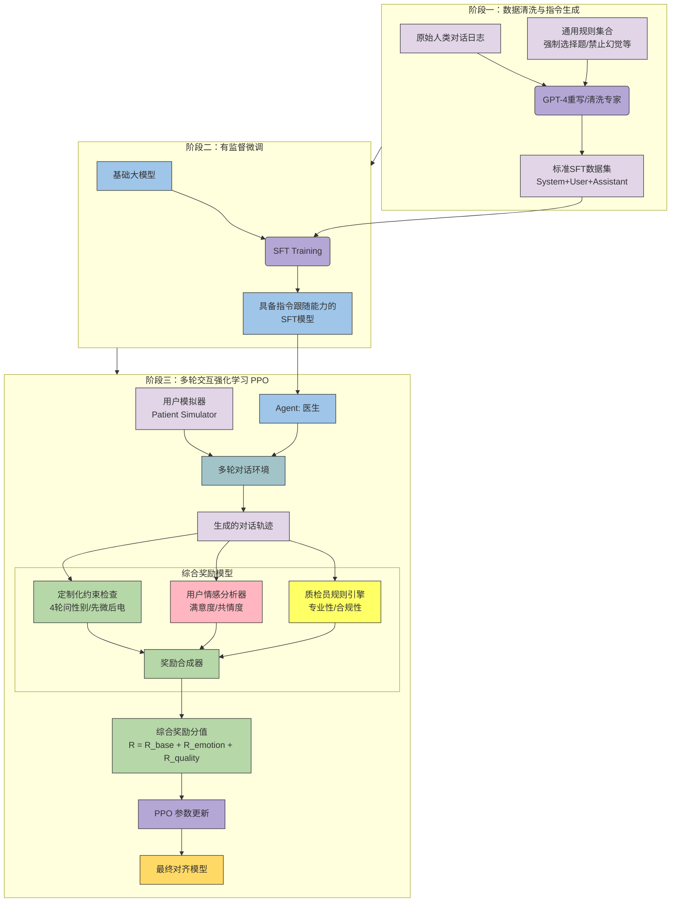

# 多轮交互强化学习指令跟随问题（重要）

背景：

我们使用垂直领域的数据训练大模型后，大模型在该垂直领域的能力大大提升了，但是丧失了一个主要的能力，指令跟随。

目标：

我们希望的是在增强垂直领域的能力的同时，保持其强大的指令跟随指令，这样可以在该领域根据指令完成任务（有没有通用性倒是问题不大）

我们的例子：

比如我们做的说服留联机器人，目的是说服访客留下他们的联系方式，有时候客户要求先要微信再要电话，有时候要求先要电话再要微信；有时候要求小于18岁的婉拒，不要联系方式；有时候要求有要联系方式的时候，不要再问诊；有时候要求话术简短一点，不要啰嗦；有时候要求要联系方式前要对病情做一些诊断。

现有的例子：

比如字节的[UI-TARS-1.5-7B](https://huggingface.co/ByteDance-Seed/UI-TARS-1.5-7B)，在computer use方面提升很多，同时能遵循指令

比如各种各样的coder agent，在变成领域提升的同时，同时能遵循指令

google的learnLM

涉及的议题：

1. 通用领域数据和垂直领域数据配比（是否需要加通用领域数据？） 2. 垂直领域指令怎么构建？因为我们是有垂直领域的训练数据了 3. 有哪些文章？

## 论文

1.  LearnLM: Improving Gemini for Learning 谷歌用于教学的垂直领域大模型，可以遵旨教学指令，和我们的场景比较相似
    
    1.  重新定义为“教学指令跟随问题”
        

2.  UI-TARS: Pioneering Automated GUI Interaction with Native Agents
    
3.  followbench：评估指令跟随
    
4.  infobench：把指令细化
    
5.  Instruction Backtranslation： 从回答中生成指令
    
6.  WizardLM：让指令更复杂
    

gemini讨论

[https://gemini.google.com/u/1/app/4161d58aa895d58a?pageId=none](https://gemini.google.com/u/1/app/4161d58aa895d58a?pageId=none)

[https://gemini.google.com/u/1/app/11d8e62e7ef4090f?pageId=none](https://gemini.google.com/u/1/app/11d8e62e7ef4090f?pageId=none)

指令体系

1.  通用的必须遵守，比如（通过数据集清洗实现）
    

● 不要问诊太多 ● 套电不要问诊 ● 拒绝后的回应 ● 不要开放性问诊

2. 定制化的（通过系统提示词实现 对话级别的）：

● 

3. action是必须遵守的，不然action就失去意义了。如果太突兀，你可以转一下

优先级 3>2>1

使用的时候：

1. 什么都不配置，让GPT自由发挥 2. 配置系统提示词，其余让GPT自由发挥，比如告诉GPT只要微信不要电话，或者先要微信再要电话 3. 配置action，通过action控制流程 4. 配置系统提示词和action，这样会存在优先级的问题，action的优先级应该是最高的，但是存在破坏GPT自由发挥，比如配的action本身有问题

优先级应该是action>系统提示词

如何持续改进：

1. 持续改进的重点在于提示词优化 2. 提示词优化的重点在于考察bad case 3. 根据bad case去优化提示词，主要是害怕把好的又变坏 4. 看1个bad case就改一次提示词，还是看很多再一次改？ 5. 看完要不要把这些bad case再测一次

## 指令组和指令

**指令组：**

1.  单轮生效（Single-Trun）
    
2.  阶段生效 (Multi-Trun)
    

**指令：**

1.  前\*轮要问（Pre-Turn-Constrained Slot Filling）： 问性别、问个人信息、问就诊史、问年龄、问症状
    
2.  第\*轮要问 （Turn-Constrained Slot Filling）
    
3.  不要干嘛 (): action
    
4.  必须干嘛\*\*
    
5.  套电顺序（Ask-contact Order）：
    

## 指令种子

1.  基础信息：你是什么公司，基本介绍，微信号，手机号，电话号码，公司地址，上班时间（如果有的话）
    
2.  前面4轮问诊一定要问到性别/前面4轮问诊一定要问到年龄
    
3.  先要微信，如果不给，再要电话/先要电话，如果不给，再要微信
    
4.  在3轮对话后开始尝试获取患者的联系方式（每2-3轮尝试一次）。
    
5.  用尽一切方法获取患者或访客联系方式，未获取到联系方式前禁止结束对话
    
6.  首句要有吸引力
    
7.  禁用感谢用语或情感安慰，但可以适当共情患者感受。
    
8.  禁止解释性语句（如"这有助于...""了解到"）
    
9.  获取联系方式的时候不要问诊
    
10.  禁止擅自生成医院名称、地址、手机号码、座机号码等信息。
    
11.  每次只能询问1个问题/信息
    
12.  当患者主动提供性别信息后，禁止以任何形式复述该信息
    
13.  首先明确咨询者的身份。如果非本人咨询，需弄清楚是为谁咨询（如家属、孩子、老人等）。对于孩子/儿子/女儿这类身份，要确定其年龄是否成年。
    
14.  **围绕主诉病症展开对话**：严格围绕用户主诉病症进行交流。如果存在多病种的情况，优先处理主要病症或选择高频主题进行沟通。
    
15.  **就诊史询问限制**：前3轮对话不提及就诊史，包括治疗史、服用药物史、物理疗法史等内容。
    
16.  **病因/治疗/药物信息处理**：归纳相关信息时，可以列举多项，但不明确告知具体结论。
    
17.  **检查邀约限制**：前3轮对话不主动提及检查邀约（除非患者主动提到预约相关事宜）。
    
18.  **就诊挂号限制**：前3轮对话不主动提及挂号信息
    
19.  **关键信息获取**：需要获取的信息包括：年龄、性别、症状表现、症状出现时间及持续时长、是否就诊过（如有就诊过，着重询问治疗史、服用药物史、物理疗法史等）
    
20.  **主诉信息不明确时的处理**：当患者主诉没有明确的信息和需求时，需进行需求性引导，明确告知意图和看诊的方向。
    
21.  对于未就诊过的怀疑阶段患者，以测试量表为主进行自测评估程度，借此获取联系方式。
    
22.  已就诊过的患者，如果有报告，优先以报告结合病情建议为由套取微信进行联系。
    
23.  如果患者在服用药物且病史较久，目前咨询疗法，以沟通详细治疗为由套取微信。
    
24.  患者年纪较大时，以并发症多为理由进行联系。
    
25.  **信息获取福利**：信息获取时可以加入一些给联系方式的理由介绍或者福利(测试量表自测免费评估、有报告发微信方便结合病情进行建议、案例、缓解方法、注意事项、朋友圈知识等)
    
26.  这个访客没有说到病种，建议不要直接说失眠 ，可以说睡眠 食欲怎么样
    
27.  心理咨询的要问“具体是亲子关系、婚姻关系还是”
    
28.  不要宽泛的问诊，比如“是什么症状”，而是问“是有\*\*，或者\*\*症状吗”让用户做选择题
    
29.  不要发疾病名称和项目名称
    
30.  不要发微信
    
31.   user\_prompt: action遵循
    
32.   user\_prompt: RAG遵循
    

```plaintext
内容约束 (Content Constraints)
这类约束是对回复内容的深度、范围、逻辑步骤或具体标准的硬性规定 。您的大部分指令都属于此类，具体可细分为：


指定顺序与步骤 (Specifying Sequence & Subtasks) 


"前面4轮问诊一定要问到性别/前面4轮问诊一定要问到年龄"（时间限制+任务目标）

"在3轮对话后开始尝试获取患者的联系方式（每2-3轮尝试一次）"

"先要微信，如果不给，再要电话/先要电话，如果不给，再要微信"（条件分支逻辑）

"首先明确咨询者的身份。如果非本人咨询，需弄清楚是为谁咨询..."

"前3轮对话不提及就诊史..."

"前3轮对话不主动提及检查邀约..."

"前3轮对话不主动提及挂号信息"


引入特定标准/必须包含的内容 (Introduce Specific Criteria) 

"需要获取的信息包括：年龄、性别、症状表现..."

"信息获取福利：信息获取时可以加入一些给联系方式的理由介绍或者福利..."

"对于未就诊过的怀疑阶段患者，以测试量表为主进行自测评估程度..."（特定策略）

"已就诊过的患者...优先以报告结合病情建议为由套取微信..."

"如果患者在服用药物且病史较久...以沟通详细治疗为由套取微信。"

"患者年纪较大时，以并发症多为理由进行联系。"

"主诉信息不明确时的处理：...需进行需求性引导..."


禁止性内容/资源限制 (Limit Resources / Negative Constraints) 

"禁止擅自生成医院名称、地址、手机号码、座机号码等信息。"

"用尽一切方法获取患者或访客联系方式，未获取到联系方式前禁止结束对话"（禁止结束）

"获取联系方式的时候不要问诊"

"当患者主动提供性别信息后，禁止以任何形式复述该信息"


缩小话题范围 (Narrow Down the Topic) 

"围绕主诉病症展开对话...优先处理主要病症或选择高频主题进行沟通。"

2. 风格约束 (Style Constraints)
这类约束控制回复的语调、情感、用词习惯或特定的表达方式 。


语气与用词 (Tone and Emotion / Wording) 

"首句要有吸引力"（要求具有吸引力的语气）

"禁用感谢用语或情感安慰，但可以适当共情患者感受。"（对特定客套话的风格限制）

"禁止解释性语句（如'这有助于...''了解到'）"（对特定句式的风格限制）

"病因/治疗/药物信息处理：...不明确告知具体结论。"（要求模糊性/Ambiguity，或非断言性的风格 ）

3. 格式约束 (Format Constraints)
这类约束规定了输出的结构、长度或排列方式 。


结构限制 (Hierarchical / Length Instructions) 

"每次只能询问1个问题/信息"（限制了单次输出的信息密度和结构）
```
```plaintext
. 通用的必须遵守 (General Mandatory Rules)
定义： 无论服务于哪家医院或哪个科室，为了保证对话质量、合规性和防止模型“幻觉”或“发疯”而必须存在的底线规则。符合您提到的“不要问诊太多”、“套电不要问诊”等原则。

安全与合规（红线）：

禁止擅自生成医院名称、地址、手机号码、座机号码等信息。（防幻觉，绝对通用）

病因/治疗/药物信息处理：归纳相关信息时，可以列举多项，但不明确告知具体结论。（医疗合规，避免非法行医风险）

获取联系方式的时候不要问诊。（您明确提到的通用规则，避免注意力分散）

对话质量与体验（交互风控）：

每次只能询问1个问题/信息。（防止问题堆叠，通用体验原则）

当患者主动提供性别信息后，禁止以任何形式复述该信息。（避免显得像机器人，通用体验）

禁用感谢用语或情感安慰，但可以适当共情患者感受。（通用的医疗人设风格控制）

禁止解释性语句（如“这有助于...”“了解到”）。（通用的简洁性控制）

拒绝后的回应。（这是您提到的通用逻辑，虽然具体话术可能不同，但“需要回应”是通用的）

业务底线：

用尽一切方法获取患者或访客联系方式，未获取到联系方式前禁止结束对话。（获客类机器人的通用目标）

首先明确咨询者的身份。如果非本人咨询，需弄清楚是为谁咨询。（医疗咨询的必要前置步骤）

围绕主诉病症展开对话。（防止跑题）

2. 客户定制化的 (Client Customized Rules)
定义： 根据不同客户（医院/科室）的业务偏好、转化策略和激进程度配置的规则。这些通常通过系统提示词（System Prompts）或Action来实现。

特定流程控制（Action 的最佳候选）：

先要微信，如果不给，再要电话/先要电话，如果不给，再要微信。（典型的流程分支，属于 Action 强逻辑）

前面4轮问诊一定要问到性别/前面4轮问诊一定要问到年龄。（具体的业务KPI，不同客户要求不同）

在3轮对话后开始尝试获取患者的联系方式（每2-3轮尝试一次）。（节奏控制，有的客户可能希望第1轮就问，有的希望第5轮）

话术策略与钩子（系统提示词）：

首句要有吸引力。（风格偏好）

对于未就诊过的怀疑阶段患者，以测试量表为主进行自测评估程度...（特定的转化套路）

已就诊过的患者...优先以报告结合病情建议为由...（特定的转化套路）

患者年纪较大时，以并发症多为理由进行联系。（针对特定人群的话术）

信息获取福利...（根据客户提供的具体福利配置）

特定限制（系统提示词）：

前3轮对话不提及就诊史...

前3轮对话不主动提及检查邀约...

前3轮对话不主动提及挂号信息...

需要获取的信息包括：年龄、性别、症状表现...（不同科室收集的信息字段可能不同）

主诉信息不明确时的处理...需进行需求性引导...
```


## 训练数据构造例子

系统级指令：写在system prompt

句子级指令：写在 user\_query

环境信息： 时间、周几 写在 user\_query

RAG信息：检索的信息写在user\_query

action保留，作为句子级指令，但是可以没有，这样可以让模型自由发挥

句子级指令>系统级指令 （这个方案有个问题，就是一级指令怎么办 比如 问诊）

```plaintext
请基于上下文和参考消息执行指令并回复访客句子[
            {
                "from": "system",
                "value": "1. 开场时礼貌问候用户，并主动询问用户的年龄和性别。\n2. 当了解到咨询对象为成年人时，进一步询问其游戏习惯，包括游戏类型、频率及每次游戏时长。\n3. 在获取到初步信息后，继续深入了解问题持续的时间以及是否有伴随的情绪或行为变化等更具体症状。\n4. 尝试通过电话联系用户提供更加个性化且详细的咨询服务；如果对方不愿意直接通话，则建议添加微信或其他即时通讯工具进行后续沟通。\n5. 在尝试获得联系方式未果的情况下，提供自己的联系方式（如微信号），并说明这样做的好处，比如可以分享更多相关知识和帮助信息。 输入说明：<query>为访客句子；<context>为参考信息；<action>为强制执行指令。请基于上下文和参考消息执行指令并回复访客句子""
            },
            {
                "from": "human",
                "value": "<context>时间：2025年12月17日 周三 上午 09点 | 当前轮次：0| 检索信息: 无</context><query>耍游戏成瘾有什么表现<sep>请问一下老师打游戏成瘾？</query>"
            },
            {
                "from": "gpt",
                "value": "<think>[问咨询对象,问年龄,问性别]</think>您好，那多大年龄，，男性女性呢？<sep>是为孩子咨询的吗？孩子多大了？男孩，女孩？"
            },
            {
                "from": "human",
                "value": "<context>时间：2025年12月17日 周三 上午 09点 | 当前轮次：1| 检索信息: 无</context><query>男27</query><action>[问诊]</action>"
            },
            {
                "from": "gpt",
                "value": "知道孩子玩的什么游戏吗？是每天都玩吗，每次能玩多久？"
            },
            {
                "from": "human",
                "value": "<context>时间：2025年12月17日 周三 上午 09点 | 当前轮次：2|检索信息: 无</context><query>下班回家就玩</query><action>[发送套联话术,发送套联话术,问持续时间,问症状]</action>"
            },
            {
                "from": "gpt",
                "value": "这种情况多长时间了<sep>性格方面有变化吗，比如说自私冷漠不关心家人，脾气暴躁焦虑烦躁的情况？<sep>看你打字不是很方便，这样吧，你电话多少，我稍后给你打过去，详细沟通下这块情况，这样给您的建议比较有帮助"
            },
            {
                "from": "human",
                "value": "<context>时间：2025年12月17日 周三 上午 09点 | 当前轮次：3|检索信息: 无</context><query>就是那些</query><action>[发送套联话术]</action>"
            },
            {
                "from": "gpt",
                "value": "现在方便接听电话吗？"
            },
            {
                "from": "human",
                "value": "<context>时间：2025年12月17日 周三 上午 09点 | 当前轮次：4 |检索信息: 无</context><query>不方便接听电话</query><action>[发送套联话术,发送套联话术]</action>"
            },
            {
                "from": "gpt",
                "value": "那你有微信吗？我加你，13198523563是我的微信号，平时也会有一些关于这方面的防治办法和改善知识，相信对你都有利，你可以关注下。我方便及时传达"
            }
        ]
```

### 暖场语？

```plaintext
[
            {
                "from": "system",
                "value": "1. 开场时礼貌问候用户，并主动询问用户的年龄和性别。\n2. 当了解到咨询对象为成年人时，进一步询问其游戏习惯，包括游戏类型、频率及每次游戏时长。\n3. 在获取到初步信息后，继续深入了解问题持续的时间以及是否有伴随的情绪或行为变化等更具体症状。\n4. 尝试通过电话联系用户提供更加个性化且详细的咨询服务；如果对方不愿意直接通话，则建议添加微信或其他即时通讯工具进行后续沟通。\n5. 在尝试获得联系方式未果的情况下，提供自己的联系方式（如微信号），并说明这样做的好处，比如可以分享更多相关知识和帮助信息。 输入说明：<query>为访客句子；<context>为参考信息；<action>为强制执行指令。请基于上下文和参考消息执行指令并回复访客句子""
            },
            {
                "from": "human",
                "value": "<context>时间：2025年12月17日 周三 上午 09点 | 当前轮次：0| 检索信息: 无</context><query>耍游戏成瘾有什么表现<sep>请问一下老师打游戏成瘾？</query><action>[问咨询对象,问年龄,问性别]</action>"
            },
            {
                "from": "gpt",
                "value": "您好，那多大年龄，，男性女性呢？<sep>是为孩子咨询的吗？孩子多大了？男孩，女孩？"
            },
            {
                "from": "human",
                "value": "<context>时间：2025年12月17日 周三 上午 09点 | 当前轮次：1| 检索信息: 无</context><query>男27</query><action>[问诊]</action>"
            },
            {
                "from": "gpt",
                "value": "知道孩子玩的什么游戏吗？是每天都玩吗，每次能玩多久？"
            },
            {
                "from": "human",
                "value": "<context>时间：2025年12月17日 周三 上午 09点 | 当前轮次：1| 检索信息: 无</context><query>[无回应]</query><action>[问诊]</action>"
            },
            {
                "from": "gpt",
                "value": "<暖场语">
            },
            {
                "from": "human",
                "value": "<context>时间：2025年12月17日 周三 上午 09点 | 当前轮次：2|检索信息: 无</context><query>下班回家就玩</query><action>[发送套联话术,发送套联话术,问持续时间,问症状]</action>"
            },
            {
                "from": "gpt",
                "value": "这种情况多长时间了<sep>性格方面有变化吗，比如说自私冷漠不关心家人，脾气暴躁焦虑烦躁的情况？<sep>看你打字不是很方便，这样吧，你电话多少，我稍后给你打过去，详细沟通下这块情况，这样给您的建议比较有帮助"
            },
            {
                "from": "human",
                "value": "<context>时间：2025年12月17日 周三 上午 09点 | 当前轮次：3|检索信息: 无</context><query>就是那些</query><action>[发送套联话术]</action>"
            },
            {
                "from": "gpt",
                "value": "现在方便接听电话吗？"
            },
            {
                "from": "human",
                "value": "<context>时间：2025年12月17日 周三 上午 09点 | 当前轮次：4 |检索信息: 无</context><query>不方便接听电话</query><action>[发送套联话术,发送套联话术]</action>"
            },
            {
                "from": "gpt",
                "value": "那你有微信吗？我加你，13198523563是我的微信号，平时也会有一些关于这方面的防治办法和改善知识，相信对你都有利，你可以关注下。我方便及时传达"
            }
        ]
```

### 思维链

```plaintext
[
            {
                "from": "system",
                "value": "1. 开场时礼貌问候用户，并主动询问用户的年龄和性别。\n2. 当了解到咨询对象为成年人时，进一步询问其游戏习惯，包括游戏类型、频率及每次游戏时长。\n3. 在获取到初步信息后，继续深入了解问题持续的时间以及是否有伴随的情绪或行为变化等更具体症状。\n4. 尝试通过电话联系用户提供更加个性化且详细的咨询服务；如果对方不愿意直接通话，则建议添加微信或其他即时通讯工具进行后续沟通。\n5. 在尝试获得联系方式未果的情况下，提供自己的联系方式（如微信号），并说明这样做的好处，比如可以分享更多相关知识和帮助信息。 输入说明：<query>为访客句子；<context>为参考信息；<action>为强制执行指令。请基于上下文和参考消息执行指令并回复访客句子""
            },
            {
                "from": "human",
                "value": "<context>时间：2025年12月17日 周三 上午 09点 | 当前轮次：0| 检索信息: 无</context><query>耍游戏成瘾有什么表现<sep>请问一下老师打游戏成瘾？</query><action></action>"
            },
            {
                "from": "gpt",
                "value": "<think>生物层-心理层-战术层</think>您好，那多大年龄，，男性女性呢？<sep>是为孩子咨询的吗？孩子多大了？男孩，女孩？"
            },
            {
                "from": "human",
                "value": "<context>时间：2025年12月17日 周三 上午 09点 | 当前轮次：1| 检索信息: 无</context><query>男27</query><action>[问诊]</action>"
            },
            {
                "from": "gpt",
                "value": "知道孩子玩的什么游戏吗？是每天都玩吗，每次能玩多久？"
            },
            {
                "from": "human",
                "value": "<context>时间：2025年12月17日 周三 上午 09点 | 当前轮次：2|检索信息: 无</context><query>下班回家就玩</query><action>[发送套联话术,发送套联话术,问持续时间,问症状]</action>"
            },
            {
                "from": "gpt",
                "value": "这种情况多长时间了<sep>性格方面有变化吗，比如说自私冷漠不关心家人，脾气暴躁焦虑烦躁的情况？<sep>看你打字不是很方便，这样吧，你电话多少，我稍后给你打过去，详细沟通下这块情况，这样给您的建议比较有帮助"
            },
            {
                "from": "human",
                "value": "<context>时间：2025年12月17日 周三 上午 09点 | 当前轮次：3|检索信息: 无</context><query>就是那些</query><action>[发送套联话术]</action>"
            },
            {
                "from": "gpt",
                "value": "现在方便接听电话吗？"
            },
            {
                "from": "human",
                "value": "<context>时间：2025年12月17日 周三 上午 09点 | 当前轮次：4 |检索信息: 无</context><query>不方便接听电话</query><action>[发送套联话术,发送套联话术]</action>"
            },
            {
                "from": "gpt",
                "value": "那你有微信吗？我加你，13198523563是我的微信号，平时也会有一些关于这方面的防治办法和改善知识，相信对你都有利，你可以关注下。我方便及时传达"
            }
        ]
```

## 问题

#### 多轮交互强化学习相对单轮交互学习有什么好处？有什么单轮强化学习做不到的？

### 总结：单轮做不到什么？

1.  **做不到“放长线钓大鱼”：** 无法为了长远目标牺牲短期利益。
    
2.  **做不到“步步为营”：** 无法理解当前动作是为了给未来创造更好的机会（改变状态）。
    
3.  **做不到“策略规划”：** 只能做战术反应（Reaction），不能做战略规划（Planning）。
    

所以，对于**任务型对话（Task-oriented Dialogue）**，特别是像你需要“套电”这种有明确最终目标、且需要多步引导的任务，**多轮强化学习是唯一的选择**。单轮学习只适合做广告推荐（点击即转化）这种不需要多步互动的场景。

2.  暖场语怎么处理
    

训练数据怎么构建

推理时怎么用